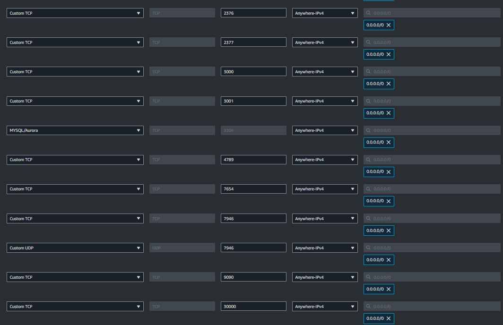

# ms_message
Services:

DB:
- Mysql(RDS)
Monitoring (Swarm Stack):
- Prometheus
- Grafana
- Loki
- Tempo
Messaging (Swarm service): 
- Spring Boot API
Reverse Proxy (Swarm service):
- Nginx

Metodo de testeo:
- Postman Collection


Para levantar la app de mensajeria, deberiamos tener una cuenta de AWS para levantar al menos 2 instancias de EC2.

Una vez dentro de nuestra cuenta, iremos a lanzar instancias de EC2, seleccionaremos la cantidad deseada (recomiendo 3: 1 manager y 2 workers).

- Seleccionaremos la "OS image" de Amazon Linux
- Generaremos o seleccionaremos el KeyPair deseado para ingresar
- En network crearemos un Security group, chequeando los los checkbox (ssh,https y http).
- En avanced details, abriremos el menu y en la seccion de "User data" (Al final del menu), arrastraremos el archivo "ec2_init.sh" ubicado en la carpeta "aws" o copiaremos su contenido manualmente. (validar que se cargue correctamente en caso de hacerlo a mano).
- Lanzar instancias seleccionadas y esperar a que se levanten.

Una vez levantadas:
- Seleccionar todas las instancias creadas desde la pagina "Instances" 
- En el menu "Instance state" seleccionar "Reboot Instance" para que se apliquen los cambios del script ec2_init.sh
- Cambiar los nombres de las instancias a "worker1", "worker2" y "manager" (es indiferente cual a que instancia, todas son iguales en este punto)

### Editar security group:
Un punto muy importante para que funcione es habilitar los puertos necesarios para que funcione swarm con los servicios, para esto seleccionaremos la instancia "manager" y en el menu que aparecera (abajo probablemente) seleccionaremos la pestaña "Security", luego haremos clic en el link que nos lleva al security group y veremos debajo una pestaña de "inbound rules".
Apretaremos el boton "Edit inbound rules" y en la nueva pantalla iremos agregando las siguientes reglas:
 - 2376/tcp (swarm) 0.0.0.0/0
 - 2377/tcp (swarm)  0.0.0.0/0
 - 3000/tcp (grafana)  0.0.0.0/0
 - 3100/tcp (loki)  0.0.0.0/0
 - 3306 mysql/aurora (Mysql)  0.0.0.0/0
 - 4789/tcp (swarm)  0.0.0.0/0
 - 7654/tcp (api java)  0.0.0.0/0
 - 7946/tcp (swarm)  0.0.0.0/0
 - 7946/udp (swarm)  0.0.0.0/0
 - 9090/tcp (prometheus)  0.0.0.0/0
 - 14268/tcp (tempo)  0.0.0.0/0


Cuando vuelvan a iniciar, iremos a la instancia que llamamos "manager". Nos conectaremos mediante ssh y correremos los siguientes comandos:
- docker swarm init 
Esto nos devolvera un comando parecido a:
- docker swarm join --token SWMTKN-1-xxxx xxx.xxx.xxx.xxx:2377
Deberiamos copiar el comando y (conectandonos mediante ssh en las instancias "workerX") correrlo y ver un mensaje del tipo:
- This node joined a swarm as a worker.

Para validar, deberiamos correr desde la instancia manager un "docker node ls" y ver tantos nodos como instancias ec2 hayamos utilizado.

Una vez realizado el paso anterior, deberiamos correr el siguiente comando en la instancia "manager":
- git clone https://github.com/AguRivarola/ms_message.git
Esto nos va a traer los archivos necesarios para poder levantar los servicios.

Una vez clonado, deberiamos tener una carpeta en el directorio donde nos encontramos. Movernos dentro con:
- cd ms_message/

# Networking
Crearemos la network que va a conectar los servicios:
- docker network create --attachable -d overlay msg-net

# Monitoring
Primeros deberiamos levantar las intancias de monitoreo:
- docker stack deploy --compose-file monitoring/docker-compose.yml  monitoring
Una vez temine de correr el comando y las instancias esten deployadas, deberiamos poder verificar con lo siguiente si estan ok:
- docker service ls
o 
- docker stack ps monitoring

# Api

Luego de que se levante el servicio anterior deberiamos poder levantar la api:

- docker service create --name mensajeria --publish published=7654,target=7654 --network msg-net bondiolino/java_app


# Nginx
Luego deberiamos levantar el proxy reverso para la redireccion:

- docker service create --name proxy --publish published=80,target=80,mode=host --mode=global --network msg-net bondiolino/nginx:1


# Testeo de app:
Deberiamos utilizar el metodo post para impactar en la ip de nginx en el endpoint "/messages" utilizando el siguiente body:

```
{
    "username": "root",
    "password": "root"
}
```
Los usuarios dispobibles son (u:agustin98, pw: 1234) y (u:root, pw:root)

# Loggeo centralizado

Para acceder a los logs centralizados deberiamos ingresar a {ip}:3000/dashboards y una vez alli, clickear en el que se llama "Logs, Traces, Metrics".

En esta deberiamos ver los logs centralizados de las calls que hayamos realizado antes a la api con informacion y errores respectivamente.
